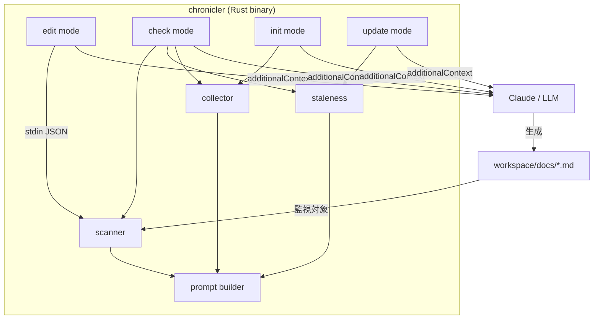

# ドキュメントライフサイクル管理を chronicler に統合

- Status: proposed
- Deciders: thkt
- Date: 2026-03-16

## コンテキスト

chroniclerはドキュメントの「監視」（staleness検知・通知）のみを担い、ドキュメントの「生成・更新」は外部の `/docs` スキルに依存していた。この分離により以下の問題が生じている：

1. ドキュメントがゼロの状態ではchroniclerが何もしない（監視対象なし）
2. `/docs` スキルはプラグインインストール時のみ利用可能で、Homebrewやリリースバイナリでは使えない
3. 「検知」と「対応」が別ツールに分かれており、ユーザーの認知負荷が高い

## 決定ドライバー

- chronicler単体でdocsライフサイクルを完結させたい
- Homebrew / リリースバイナリのユーザーにも生成機能を提供したい
- 既存のhook設計思想（JSONで指示を返す薄い連携）を維持したい
- バイナリの軽量さ・高速さを損なわない

## 検討した選択肢

### A. プロンプト出力方式（薄い LLM 連携）

chroniclerがソース構造を収集し、LLM向けのプロンプト + コンテキストをhook JSONの `additionalContext` として出力。実際のドキュメント生成はLLMが行う。

- Good: 既存のhook設計パターンと一貫（JSONで指示を返すだけ）
- Good: バイナリにLLM依存が入らない。deps増加なし
- Good: Homebrew / リリースバイナリでも同じ体験
- Bad: LLMがないと生成できない（Claude Code前提）

### B. テンプレート生成方式

chroniclerがソース構造を解析し、定型のドキュメントテンプレートを直接ファイル出力。

- Good: LLM不要で動作
- Bad: 生成品質に限界（コードの意味理解ができない）
- Bad: テンプレートエンジン依存が増える
- Bad: 既存hookパターン（stdout JSON）と一致しない

### C. LLM API 直接呼び出し方式

chroniclerがAnthropic APIを直接呼び出してドキュメントを生成。

- Good: スタンドアロンで完結
- Bad: API key管理が必要
- Bad: depsが大幅に増加（HTTP client, async runtime等）
- Bad: バイナリサイズ・ビルド時間が増大

## 決定

**A. プロンプト出力方式**を採用。chroniclerは判断材料（ソース構造、stale情報）を収集し、LLM向けプロンプトを `additionalContext` に載せて返す。

併せてサブコマンド体系を刷新する：

| 旧      | 新     | 変更理由                    |
| ------- | ------ | --------------------------- |
| (stdin) | edit   | 変更なし                    |
| stop    | check  | 意図の明確化（検査 ≠ 停止） |
| (なし)  | init   | 新規追加                    |
| (なし)  | update | 新規追加                    |

### ポジティブな結果

- chronicler 1つでドキュメントライフサイクル全体を管理できる
- `/docs` スキルへの依存がなくなり、インストール方法を問わず同じ体験
- 既存のhook設計思想を維持（バイナリは軽量なまま）
- checkサブコマンドがdocsなし状態を検知し、initプロンプトを出せるようになる

### ネガティブな結果

- Claude Code（LLM）がないとドキュメント生成は実行されない
- stop→checkのリネームによりwrapper.sh / hooks.jsonの更新が必要（v0.1.xのため影響は限定的）

## アーキテクチャ図

## 品質属性

| 属性   | 優先度 | アプローチ                           |
| ------ | ------ | ------------------------------------ |
| 軽量性 | 高     | プロンプト出力のみ、deps 増加なし    |
| 一貫性 | 高     | 全モード hook JSON 形式で統一        |
| 保守性 | 中     | collector, prompt を独立モジュール化 |
| 拡張性 | 低     | 現時点では不要                       |

## トレードオフ

- LLM依存と引き換えに、バイナリの軽量さと設計の一貫性を維持
- サブコマンド名の変更（stop→check）と引き換えに、意図の明確化を獲得
