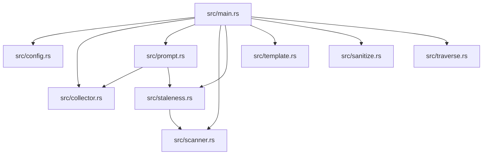
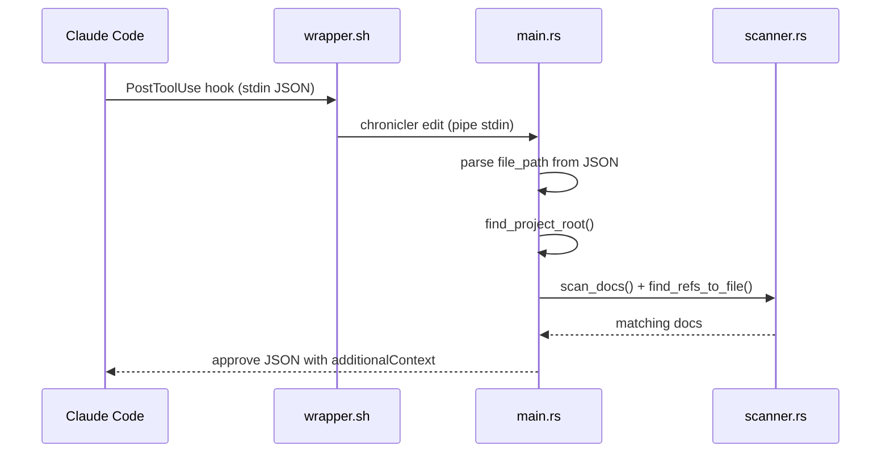
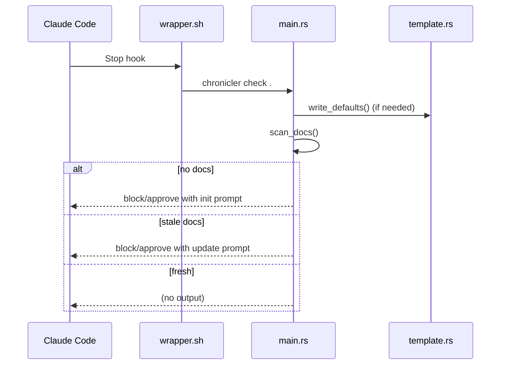

# chronicler - Architecture Overview

## Technology Stack

| Category | Technology    | Version      |
| -------- | ------------- | ------------ |
| Language | Rust          | 2024 edition |
| Runtime  | Native binary | -            |

## Directory Structure

```
src/
  collector.rs
  config.rs
  main.rs
  prompt.rs
  sanitize.rs
  scanner.rs
  staleness.rs
  template.rs
  templates/
    api.md
    architecture.md
    domain.md
    setup.md
  test_utils.rs
  traverse.rs
hooks/
  hooks.json
  install.sh
  wrapper.sh
adr/
  0001-integrate-doc-lifecycle-into-chronicler.md
  README.md
```

## Module Structure



## Data Flow

### PostToolUse (edit mode)



### Stop (check mode)



## Key Components

| Component   | Path                  | Description                                                              |
| ----------- | --------------------- | ------------------------------------------------------------------------ |
| Entry point | `src/main.rs:1`       | Dual-mode CLI: dispatches edit/init/update/check subcommands             |
| Config      | `src/config.rs:27`    | Loads `ChroniclerConfig` from `.claude/tools.json` with defaults         |
| Scanner     | `src/scanner.rs:23`   | Scans docs for `file:line` references via regex                          |
| Staleness   | `src/staleness.rs:10` | Compares mtime of referenced files vs doc files                          |
| Collector   | `src/collector.rs:24` | Walks project tree, skipping .git/node_modules/target                    |
| Prompt      | `src/prompt.rs:19`    | Builds init/update prompts with template paths and file tree             |
| Template    | `src/template.rs:21`  | Embeds default templates via `include_str!`, writes missing ones to disk |
| Sanitize    | `src/sanitize.rs:1`   | Output truncation: `truncate_bytes` (200KB) and `tail_lines` (100 lines) |
| Traverse    | `src/traverse.rs:5`   | Finds project root by walking ancestors for `.git`                       |

## Dependencies

### External

| Crate      | Purpose                                         |
| ---------- | ----------------------------------------------- |
| serde      | JSON deserialization for config and hook input  |
| serde_json | JSON serialization/deserialization for hook I/O |
| regex      | `file:line` reference pattern matching in docs  |

### Internal

- `main` → `config`: loads project configuration
- `main` → `scanner` + `staleness`: freshness detection pipeline
- `main` → `collector` + `prompt`: documentation generation pipeline
- `main` → `template`: default template management
- `main` → `sanitize`: output size control
- `main` → `traverse`: project root detection
- `prompt` → `collector`: uses `SourceTree` for init prompts
- `prompt` → `staleness`: uses `StaleDoc` for update prompts
- `staleness` → `scanner`: uses `DocRefs` for mtime comparison
