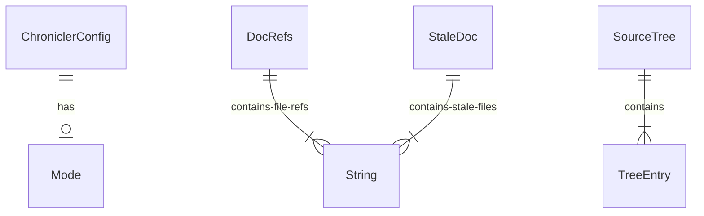

# chronicler - Domain Documentation

## Glossary

| Term                | Definition                                                              | Context                    | Source                |
| ------------------- | ----------------------------------------------------------------------- | -------------------------- | --------------------- |
| DocRefs             | A documentation file and the source file references it contains         | Core scanning unit         | `src/scanner.rs:9`    |
| StaleDoc            | A documentation file whose referenced source files have newer mtimes    | Staleness detection output | `src/staleness.rs:5`  |
| SourceTree          | Collection of file paths in a project, used for init prompts            | Tree collection output     | `src/collector.rs:15` |
| TreeEntry           | A single file or directory entry in the project tree                    | SourceTree element         | `src/collector.rs:19` |
| ChroniclerConfig    | Per-project configuration loaded from `.claude/tools.json`              | Configuration              | `src/config.rs:27`    |
| Mode                | Warn or Block — controls whether chronicler advises or blocks on issues | Configuration enum         | `src/config.rs:7`     |
| file:line reference | A `path/to/file.ext:42` pattern in documentation linking to source code | Core detection pattern     | `src/scanner.rs:7`    |

## Entities

### ChroniclerConfig

> Source: `src/config.rs:27`

| Field     | Type   | Nullable | Description                         | Source             |
| --------- | ------ | -------- | ----------------------------------- | ------------------ |
| dir       | String | No       | Documentation directory to scan     | `src/config.rs:28` |
| templates | String | No       | Template directory path             | `src/config.rs:29` |
| edit      | bool   | No       | Enable PostToolUse edit detection   | `src/config.rs:30` |
| stop      | bool   | No       | Enable Stop hook check              | `src/config.rs:31` |
| mode      | Mode   | No       | Warn (advisory) or Block (blocking) | `src/config.rs:32` |

**Invariants**:

- All fields have defaults via `impl Default` (`src/config.rs:35`)
- Unknown `mode` values default to Warn with stderr warning (`src/config.rs:14`)

### DocRefs

> Source: `src/scanner.rs:9`

| Field     | Type          | Nullable | Description                              | Source              |
| --------- | ------------- | -------- | ---------------------------------------- | ------------------- |
| doc_path  | PathBuf       | No       | Absolute path to the documentation file  | `src/scanner.rs:10` |
| file_refs | Vec\<String\> | No       | List of file paths referenced in the doc | `src/scanner.rs:11` |

### StaleDoc

> Source: `src/staleness.rs:5`

| Field        | Type          | Nullable | Description                            | Source               |
| ------------ | ------------- | -------- | -------------------------------------- | -------------------- |
| doc_relative | String        | No       | Project-relative path to the stale doc | `src/staleness.rs:6` |
| stale_files  | Vec\<String\> | No       | Source files modified after the doc    | `src/staleness.rs:7` |

### SourceTree

> Source: `src/collector.rs:15`

| Field   | Type             | Nullable | Description                          | Source                |
| ------- | ---------------- | -------- | ------------------------------------ | --------------------- |
| entries | Vec\<TreeEntry\> | No       | Sorted list of files and directories | `src/collector.rs:16` |

### TreeEntry

> Source: `src/collector.rs:19`

| Field  | Type   | Nullable | Description                  | Source                |
| ------ | ------ | -------- | ---------------------------- | --------------------- |
| path   | String | No       | Project-relative path        | `src/collector.rs:20` |
| is_dir | bool   | No       | Whether entry is a directory | `src/collector.rs:21` |

## Relationships

| From                        | To                 | Type        | Description                           | Source                |
| --------------------------- | ------------------ | ----------- | ------------------------------------- | --------------------- |
| ChroniclerConfig            | Mode               | composition | Config owns its mode setting          | `src/config.rs:32`    |
| DocRefs                     | String (file_refs) | composition | Doc contains referenced file paths    | `src/scanner.rs:11`   |
| staleness::check_staleness  | DocRefs            | input       | Staleness check reads doc references  | `src/staleness.rs:10` |
| prompt::build_init_prompt   | SourceTree         | input       | Init prompt includes file tree        | `src/prompt.rs:19`    |
| prompt::build_update_prompt | StaleDoc           | input       | Update prompt includes stale doc info | `src/prompt.rs:59`    |
